# STEP 3 — Database ERD

Central idea: **`profiles` is the person** (visitor, newcomer, member, leader…). A profile *may* have a login account in `users` (1:1, optional). Every ministry module points at `profiles`, so a newcomer who never registers an account can still be followed up, join a LifeGroup, take One 2 One and appear in the discipleship tree.

```mermaid
erDiagram
    users ||--o| profiles : "has (optional)"
    users }o--o{ roles : "spatie model_has_roles"
    roles }o--o{ permissions : "role_has_permissions"
    users }o--o{ campuses : "campus_user (campus ministry scope)"

    campuses ||--o{ profiles : students
    campuses ||--o{ life_groups : ""
    campuses ||--o{ events : ""

    profiles ||--o| newcomers : "newcomer journey"
    profiles ||--o{ involvement_requests : "submits"
    involvement_requests }o--o{ involvement_interests : "involvement_request_interest"
    involvement_requests }o--o{ ministries : "involvement_request_ministry"

    follow_up_tasks }o--|| users : "assigned_to"
    follow_up_tasks }o--|| profiles : "about"
    follow_ups }o--|| users : "author"
    follow_ups }o--|| profiles : "about"

    life_groups ||--o{ life_group_members : ""
    profiles ||--o{ life_group_members : ""
    life_groups ||--o{ life_group_join_requests : ""
    life_groups ||--o{ life_group_meetings : ""
    life_group_meetings ||--o{ life_group_attendances : ""
    profiles ||--o{ life_group_attendances : ""
    profiles ||--o{ life_groups : "leads (leader_profile_id)"

    discipleship_stages ||--o{ discipleship_programs : ""
    discipleship_programs ||--o{ curriculum_chapters : "chapters / lessons / sessions outline"
    discipleship_programs ||--o| discipleship_programs : "prerequisite"
    profiles ||--o{ member_program_progress : ""
    discipleship_programs ||--o{ member_program_progress : ""
    member_program_progress ||--o{ member_chapter_progress : ""
    curriculum_chapters ||--o{ member_chapter_progress : ""

    profiles ||--o{ discipler_relationships : "as discipler"
    profiles ||--o{ discipler_relationships : "as disciple"
    discipler_relationships ||--o{ discipleship_meetings : ""

    discipleship_programs ||--o{ class_batches : ""
    class_batches ||--o{ class_sessions : ""
    class_batches ||--o{ class_participants : ""
    class_sessions ||--o{ class_attendance : ""
    class_participants ||--o{ class_attendance : ""

    profiles ||--o| leadership_candidates : ""

    ministries ||--o{ ministry_roles : ""
    ministries ||--o{ ministry_members : ""
    profiles ||--o{ ministry_members : ""
    ministries }o--o{ volunteer_applications : "volunteer_application_ministry"
    ministries ||--o{ serving_schedules : ""

    event_categories ||--o{ events : ""
    events ||--o{ event_registrations : ""
    profiles ||--o{ event_registrations : ""

    sermon_series ||--o{ sermons : ""
    sermons ||--o{ sermon_points : ""
    galleries ||--o{ gallery_images : ""

    profiles ||--o{ prayer_requests : ""
    pastoral_care_categories ||--o{ pastoral_care_requests : ""
    pastoral_care_requests ||--o{ pastoral_care_notes : ""

    profiles ||--o{ timeline_entries : "member timeline"
    users ||--o{ audit_logs : ""
```

## Table catalogue

| Area | Tables |
|---|---|
| Identity | `users` (account_status: pending_verification / active / inactive), `profiles`, `campuses`, `campus_user`, spatie `roles` / `permissions` / `model_has_roles` / `model_has_permissions` / `role_has_permissions` |
| Newcomer & Get Involved | `newcomers`, `involvement_requests`, `involvement_interests`, `involvement_request_interest`, `involvement_request_ministry` |
| Care follow-up | `follow_up_tasks` (assignable, due date), `follow_ups` (notes / contact log, `is_internal`) |
| LifeGroup | `life_groups`, `life_group_members`, `life_group_join_requests`, `life_group_meetings`, `life_group_attendances` |
| Discipleship | `discipleship_stages`, `discipleship_programs` (type BOOK/CLASS/TRAINING/EVENT), `curriculum_chapters`, `member_program_progress`, `member_chapter_progress`, `discipler_relationships`, `discipleship_meetings` |
| Classes | `class_batches`, `class_sessions`, `class_participants`, `class_attendance` |
| Leadership | `leadership_candidates` |
| Ministry | `ministries`, `ministry_roles`, `ministry_members` (= volunteers), `volunteer_applications`, `volunteer_application_ministry`, `serving_schedules` |
| Events | `event_categories`, `events`, `event_registrations` |
| Content | `devotionals`, `sermon_series`, `sermons`, `sermon_points`, `galleries`, `gallery_images`, `pages`, `announcements`, `media`, `site_settings` |
| Care | `prayer_requests`, `pastoral_care_categories`, `pastoral_care_requests`, `pastoral_care_notes` (encrypted) |
| Certificates & personal files | `certificates` (uploaded baptism / other certificates, numbered one-time program certificates), `prophetic_words` (private audio, encrypted notes); `profiles.baptism_status / baptism_date / baptism_place`; `discipleship_programs.certificate_type` (`count` = repeatable journey record, `once` = Leadership 113 / 215 certificate) |
| System | `notifications`, `jobs`, `audit_logs`, `timeline_entries` |

### Naming notes
* **`curriculum_books`** from the brief is modelled as `discipleship_programs` where `type = book` (Purple Book, One 2 One). A separate table added no information, and keeping one hierarchy (Stage → Program → Chapter) keeps the curriculum fully configurable.
* **One 2 One** is the Engage-stage BOOK program; a One 2 One "record" is a `member_program_progress` row for that program (disciple, discipler, start, expected, completed), and each lesson is a `member_chapter_progress` row.
* **Victory Weekend** is an EVENT-type program flagged `is_milestone`; each weekend is a `class_batches` row, so registration, attendance and completion reuse the class engine. The Preparing for Victory status is read from that participant's PfV progress.
* Sensitive columns (`pastoral_care_requests.description`, `pastoral_care_notes.body`, private prayer text) use Laravel's `encrypted` cast.
